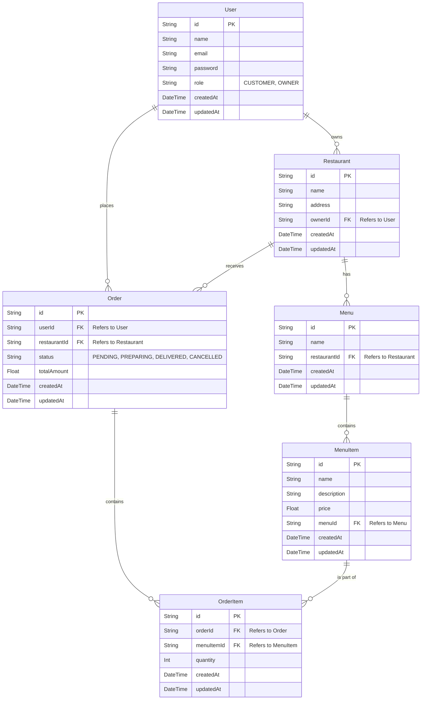

# Database Schema Diagram

Below is the Entity-Relationship Diagram for the Restaurant API Database.

```mermaid
erDiagram
    User {
        String id PK
        String name
        String email
        String password
        String role "CUSTOMER, OWNER"
        DateTime createdAt
        DateTime updatedAt
    }

    Restaurant {
        String id PK
        String name
        String address
        String ownerId FK "Refers to User"
        DateTime createdAt
        DateTime updatedAt
    }

    Menu {
        String id PK
        String name
        String restaurantId FK "Refers to Restaurant"
        DateTime createdAt
        DateTime updatedAt
    }

    MenuItem {
        String id PK
        String name
        String description
        Float price
        String menuId FK "Refers to Menu"
        DateTime createdAt
        DateTime updatedAt
    }

    Order {
        String id PK
        String userId FK "Refers to User"
        String restaurantId FK "Refers to Restaurant"
        String status "PENDING, PREPARING, DELIVERED, CANCELLED"
        Float totalAmount
        DateTime createdAt
        DateTime updatedAt
    }

    OrderItem {
        String id PK
        String orderId FK "Refers to Order"
        String menuItemId FK "Refers to MenuItem"
        Int quantity
        DateTime createdAt
        DateTime updatedAt
    }

    User ||--o{ Restaurant : "owns"
    User ||--o{ Order : "places"
    Restaurant ||--o{ Menu : "has"
    Restaurant ||--o{ Order : "receives"
    Menu ||--o{ MenuItem : "contains"
    Order ||--o{ OrderItem : "contains"
    MenuItem ||--o{ OrderItem : "is part of"
```
